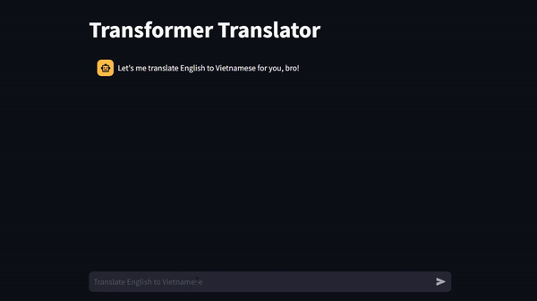
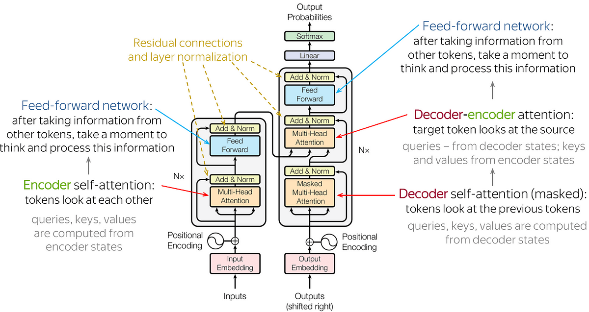
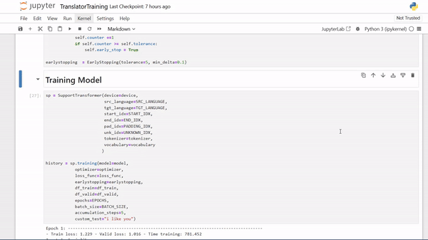

# Transformer - English to Vietnamese - Translator

[](https://www.python.org/downloads/release/python-3100/)
[](https://pytorch.org/)
[](https://en.wikipedia.org/wiki/MIT_License)

In this project we will learn about the Transformer model as well as build a translation model from English to Vietnamese. This will help us learn more about the basic large language model and get ready for other projects.



## 📑 Requirements

- **Python Jupyter notebook** - [Anaconda](https://anaconda.org/anaconda/jupyter)

- **Pytorch with CUDA** - [Pytorch](https://pytorch.org/)

- **Underthesea** - [Underthesea](https://pypi.org/project/underthesea/)

- **Some python libraries** - [requirement](./requirements.txt)

```
pip install -r requirements.txt
```

Or we can use [Google Colab notebook](https://colab.research.google.com/) or [kaggle notebook](https://www.kaggle.com/) (Pytorch with CUDA, some libraries are available!) 

## 💾 Transformer Understanding



The Transformer model is a deep learning architecture introduced in the paper "[Attention is All You Need](https://proceedings.neurips.cc/paper_files/paper/2017/file/3f5ee243547dee91fbd053c1c4a845aa-Paper.pdf)"** by Vaswani et al. (2017). It has revolutionized natural language processing and other domains by addressing sequential and hierarchical data using attention mechanisms instead of recurrent or convolutional layers.

For more, check notebook [TransformerNeuralNetworks.ipynb](./Transformer_Understanding/TransformerNeuralNetworks.ipynb)

## 📝 Building & Training Translating Model with Transformer Architecture

Check [MyTransformer.py](./MyTransformer.py) and [BuildingTransformerModel.ipynb](./BuildingTransformerModel.ipynb) for understanding the simple ways to build a Transformer model for translating!

Dataset for train: ncduy. (n.d.). mt-en-vi. Hugging Face. Retrieved June 14, 2024, from https://huggingface.co/datasets/ncduy/mt-en-vi

The dataset has more 2 millions rows but only 200.000 rows were taken to train (the limitation of CUDA memory)



## 🔮 Demo with Streamlit

Clone this project and run demo!

```
steamlit run Translator_streamlit.py
```


## 💗 References

Ajay Halthor - [@CodeEmporium](https://www.youtube.com/@CodeEmporium)

PyTorch. (n.d.). PyTorch. Retrieved June 15, 2024, from https://pytorch.org/docs/stable/index.html

PyTorch. (n.d.). PyTorch text. Retrieved June 15, 2024, from https://pytorch.org/text/stable/

Nguyen, H. (n.d.). English to Vietnamese with Transformer. Kaggle. Retrieved June 15, 2024, from https://www.kaggle.com/code/huhuyngun/english-to-vietnamese-with-transformer

